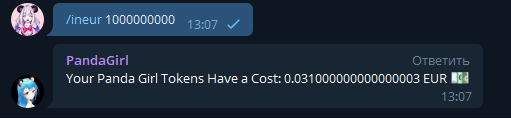

# PandaGirlBot
## Bot telegram for crypto project Panda Girl

The CG API and HEROKU web application hosting are used for the operation of the telegram bot.

The work of the bot can be viewed in the telegram channel [Panda Girl](https://t.me/PandaGirlToken)

# Command:
/pgirl - Price Panda Girl Token

/inusd <num> - Convert PGIRL to USD

/ineur <num> - Convert PGIRL to EUR

# ScreenShots

# The application uses:
[Goin Gecko API](https://www.coingecko.com/en/api)

[Heroku is a cloud platform](https://www.heroku.com/home)

